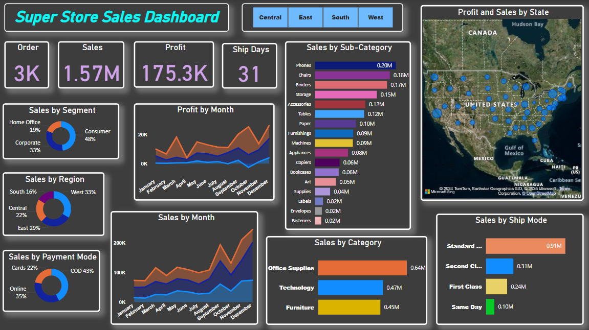

# 📊 Super Store Sales Dashboard – Power BI Project

## 🚀 Project Overview

This project is a **learning-based Power BI dashboard** built using a publicly available **Sample Superstore dataset** (not related to any real-world organization). The goal of this project was to practice **data visualization, analytics, and storytelling with dashboards**.

The dashboard provides a 360° view of sales performance across categories, regions, shipping modes, and sub-categories with interactive features for deeper insights.

---

## ✨ Key Insights

* **Total Sales**: \$1.57M | **Profit**: \$175.3K | **Orders**: 3K
* **Top Region**: West (33%), followed by East (29%)
* **Best-Selling Category**: Office Supplies (\$0.64M)
* **Top Sub-Categories**: Phones, Chairs, and Binders
* **Shipping Trend**: Standard Class dominates with \$0.91M in sales
* **Seasonality**: November & December peak in sales and profit → strong holiday shopping season

---

## 🔧 Techniques & Features Used

* ✅ **Data Cleaning & Transformation** (Power Query)
* ✅ **DAX Calculations** for custom metrics
* ✅ **Interactive Filters & Drill-downs** for region-wise analysis
* ✅ **Map Visualization** for profit and sales by state
* ✅ **KPI Cards, Pie Charts, and Line Graphs** for performance tracking

---

## 📸 Dashboard Preview

---

## 🛠 Tools & Technologies

* **Power BI Desktop**
* **DAX (Data Analysis Expressions)**
* **Power Query**
* **Data Visualization Techniques**

---

## 🎯 Learning Outcomes

* Strengthened **Power BI dashboard design** and **data storytelling** skills
* Understood the importance of **visual KPIs for decision-making**
* Practiced **end-to-end workflow**: data cleaning → modeling → visualization → insights

---

## 📌 How to Use

1. Download the `.pbix` file from this repository.
2. Open it in **Power BI Desktop**.
3. Explore the interactive filters, categories, and region-based insights.

---

## 🤝 Feedback & Collaboration

I’d love to hear your thoughts! Feel free to open issues, suggest improvements, or connect with me on [LinkedIn](https://www.linkedin.com/in/sneha-bhagat-43a22a232/).

---
